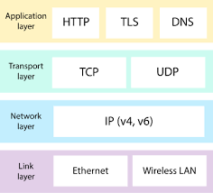

# ⛓ Intro to Protocols

> [!NOTE]
> This plan is a work in progress. Please check back at the start of class for updates.

<!-- > -->

<!-- omit in toc -->
## ⏱ Agenda {docsify-ignore}

- [[**05m**] 🏆 Objectives](#05m--objectives)
- [[**20m**] 👋 Welcome to Class](#20m--welcome-to-class)
- [[**30m**] 📖 Overview: Network Protocols](#30m--overview-network-protocols)
- [[**10m**] 🌴 BREAK](#10m--break-docsify-ignore)
- [[**07m**] 📼 Watch Video: Packets, Routing, & Reliability](#07m--watch-video-packets-routing--reliability)
- [[**60m**] 💻 Activity: Code.org Lessons](#60m--activity-codeorg-lessons)
- [📚 Resources & Credits](#-resources--credits)

<!-- > -->

## [**05m**] 🏆 Objectives

1. Present an overview of the course and syllabus.
1. Define the term `protocol` and describe when and where they are used.
1. List common protocols used by developers.
1. Create a diagram of data flowing through a protocol.

<!-- > -->

## [**20m**] 👋 Welcome to Class

Instructor will walk through the [syllabus](https://make.sc/bew2.4) and answer questions about the course.

Students, remember to join the course Slack channel, `#bew2-4-dapps`!

<!-- > -->

## [**30m**] 📖 Overview: Network Protocols

<!-- > -->

> **Protocol**: Standard set of rules that allow devices to communicate with one other.

 Protocols are a fundamental aspect of digital communication, and are the **digital equivalent to spoken language**! If two people share the same language, they can communicate effectively; similarly, **if two hardware devices support the same protocol, they can communicate with each other --- regardless of the manufacturer or type of device**.

The rules of each protocol must describe...

- What **type of data** can be transmitted.
- What **commands are used** to send and receive the data.
- How **transfers** of the data are **verified**.

📲**IMPORTANT**: _In Objective-C and Swift, a `protocol` is a syntactic structure that defines a blueprint of methods, properties, and other requirements that suit a particular task or piece of functionality. The above definition is most common._

<!-- > -->

### Real Life Examples

| Task | Protocol |
| :--- | :------: |
| Sending an email | [SMTP](https://techterms.com/definition/smtp) |
| Visiting a website | [HTTP](https://techterms.com/definition/http) |

<!-- > -->

<!-- > -->

### Four Categories

<!-- > -->

#### :one: Link Layer&nbsp;&nbsp;&nbsp;&nbsp;[PPP](https://techterms.com/definition/ppp), [DSL](https://techterms.com/definition/dsl), [Wi-Fi](https://techterms.com/definition/wi-fi)

Establish communication between devices at a hardware level.

The hardware on each device must support the same link layer protocol to transmit data to one another.

<!-- > -->

#### :two: Internet Layer&nbsp;&nbsp;&nbsp;&nbsp;[IPv4](https://techterms.com/definition/ipv4), [IPv6](https://techterms.com/definition/ipv6)

Initiate data transfers and route them over the internet.

<!-- > -->

#### :three: Transport Layer&nbsp;&nbsp;&nbsp;&nbsp;[TCP](https://techterms.com/definition/tcp), [UDP](https://techterms.com/definition/udp)

Define how [packets](https://techterms.com/definition/packet) are sent, received, and confirmed.

<!-- > -->

#### :four: Application Layer&nbsp;&nbsp;&nbsp;&nbsp;[HTTP](https://techterms.com/definition/http), [IMAP](https://techterms.com/definition/imap), [FTP](https://techterms.com/definition/ftp)

Contain commands for specific applications.

- **Example 1**: _Browser uses [HTTPS](https://techterms.com/definition/https) to securely download the contents of a webpage from a web server._
- **Example 2**: _Email client uses [SMTP](https://techterms.com/definition/smtp) to send email messages through a mail server._

<!-- > -->

## [**10m**] 🌴 BREAK {docsify-ignore}

<!-- > -->

## [**07m**] 📼 Watch Video: Packets, Routing, & Reliability

  <iframe height="480" src="https://www.youtube.com/embed/AYdF7b3nMto" frameborder="0" allow="accelerometer; autoplay; encrypted-media; gyroscope; picture-in-picture" allowfullscreen></iframe>

<!-- > -->

## [**60m**] 💻 Activity: Code.org Lessons

1. Join [Code.org Section](https://studio.code.org/join/RZFRVG)
1. Begin working on **Lessons 8 through Lessons 11** in [Chapter 2: Inventing the Internet](https://studio.code.org/s/csp1-2018?section_id=2909525&viewAs=Student) in your breakout groups of 3 to 4.
1. **Make sure you complete the activities!** What you learn through your experiments with the Internet Simulator will be utilized throughout this course. Make sure you complete the reflection questions when asked.
1. This activity earns you participation credit in the course. The instructor will check your progress on the Code.org dashboard and randomly visit your breakout rooms to verify your participation.

<!-- > -->

## 📚 Resources & Credits

- [**TechTerms**: Protocol Definition](https://techterms.com/definition/protocol)
